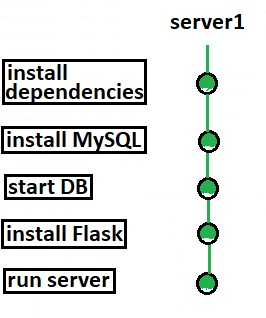
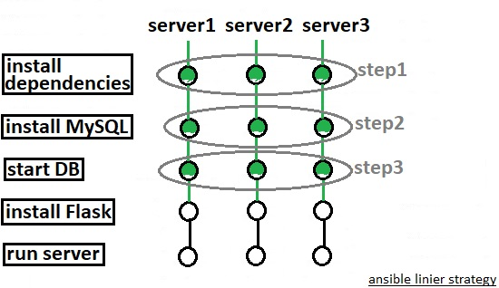
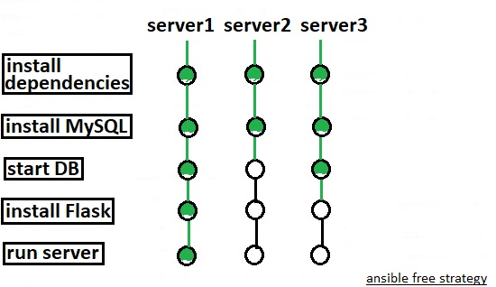
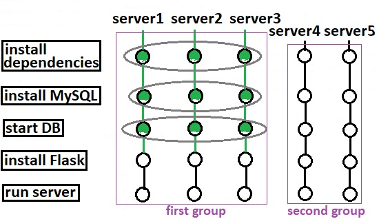
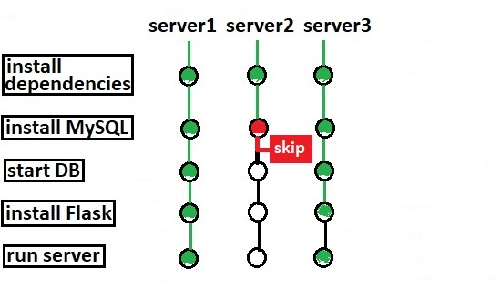
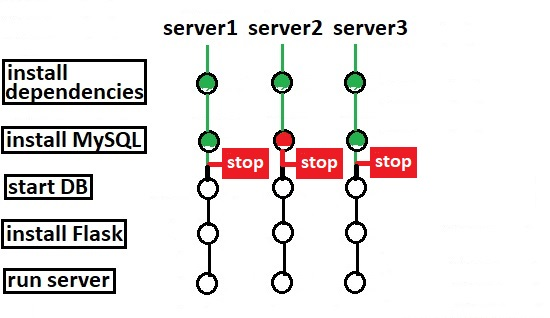

# Advanced Topics

## How to handle long running tasks in Ansible?

By default Ansible runs tasks synchronously, holding the connection to the remote node open until the action is completed. This means within a playbook, each task blocks the next task by default, meaning subsequent tasks will not run until the current task completes.


 This behavior can create challenges. For example, a task may take longer to complete than the SSH session allows for, causing a timeout. Or you may want a long-running process to execute in the background while you perform other tasks concurrently. Asynchronous mode lets you control how long-running tasks execute.

### What is Asynchronous mode?

Asynchronous mode allows us to control the playbook execution flow by defining how long-running tasks completes their execution.

To enable Asynchronous mode within Ansible playbook we need to use few parameters such as **`async`**, **`poll`**.

* **`async:`** Async indicates the Total time to complete the task or its maximum runtime of the task.
* **`poll:`** poll indicates to Ansible, how often to poll to check if the command has been completed. or how frequently you would like to poll for status. with poll we keep checking whether the job is completed or not. The default poll value is 10 seconds.

```text
---
#async and poll example playbook

- hosts: centos
  become: yes

  tasks:

  - name: simulate long running op (15 sec), wait for up to 45 sec, poll every 5 sec
    command: /bin/sleep 15
    async: 45 #How long to run?
    poll: 5 #How frequently to check? (default 10 sec)
```


Remember all the modules do not support async, so you need to make sure that what ever module you're using supports async.


#### Avoid connection timeouts: poll &gt; 0

 If you want to set a longer timeout limit for a certain task in your playbook, use `async` with `poll` set to a positive value. **Ansible will still block the next task in your playbook, waiting until the async task either completes, fails or times out**. However, the task will only time out if it exceeds the timeout limit you set with the `async` parameter.

```text
---
# async and poll example1 playbook
- name: sleep and create a user 
  hosts: centos
  become: true

  tasks:
    - name: sleep for 15 seconds
      command: /bin/sleep 15
      async: 45 # the total time allowed to complete the sleep task
      poll: 5 # No need to poll just fire and forget the sleep command
      register: sleeping_node

    - name: task-2 to create a test user
      user: name=mona state=present shell=/bin/bash
```

#### Run tasks concurrently: poll = 0

 If you want to run multiple tasks in a playbook concurrently, use `async` with `poll` set to 0. When you set `poll: 0`, Ansible starts the task and immediately **moves on to the next task without waiting for a result**. Each async task runs until it either completes, fails or times out \(runs longer than its `async` value\). The playbook run ends without checking back on async tasks.

```text
---
# async and poll example2 playbook
- name: sleep and create a user 
  hosts: centos
  become: true

  tasks:
    - name: sleep for 60 seconds
      command: /bin/sleep 60
      async: 80 # the total time allowed to complete the sleep task
      poll: 0 # No need to poll just fire and forget the sleep command
      register: sleeping_node

    - name: task-2 to create a test user
      user: name=lisa state=present shell=/bin/bash
```

### Ansible async\_status

Ansible provides the option to get the task status in any time. Using ansible async\_status we can get the status of async task at any time.

```text
---
# async and poll example3 playbook
- name: sleep and create a user and check async-status
  hosts: centos
  become: true

  tasks:
    - name: sleep for 20 seconds
      command: /bin/sleep 20
      async: 30 # the total time allowed to complete the sleep task
      poll: 0 # No need to poll just fire and forget the sleep command
      register: sleeping_node

    - name: task-2 to create a test user
      user: name=lara state=present shell=/bin/bash
      
    - name: Checking the Job Status running in background
      async_status:
        jid: "{{ sleeping_node.ansible_job_id }}"
      register: job_result
      until: job_result.finished # Retry within limit until the job status changed to "finished": 1
      retries: 5 # Maximum number of retries to check job status
```

> execute the playbook with `-v` option so that we can see the Job ID of first task to check its status later.

To check the status of first task on target  node\(s\) in a later time we can use ad hoc commands:

```text
ansible centos -m async_status -a "jid=903212800377.10413" 
```

### Asynchronous ad hoc tasks

You can execute long-running operations in the background with ad hoc tasks. For example, to execute long\_running\_operation asynchronously in the background, with a timeout \(-B\) of 3600 seconds, and without polling \(-P\):

```text
ansible centos -B 3600 -P 0 -a "/usr/bin/long_running_operation --do-stuff"
```

Again  to check on the job status later, use the `async_status` module, passing it the job ID that was returned when you ran the original job in the background:

```text
ansible web1.example.com -m async_status -a "jid=488359678239.2844"
```

Ansible can also check on the status of your long-running job automatically with polling. In most cases, Ansible will keep the connection to your remote node open between polls. To run for 30 minutes and poll for status every 60 seconds:

```text
ansible all -B 1800 -P 60 -a "/usr/bin/long_running_operation --do-stuff"
```

> Poll mode is smart so all jobs will be started before polling begins on any machine. Be sure to use a high enough `--forks` value if you want to get all of your jobs started very quickly. After the time limit \(in seconds\) runs out \(`-B`\), the process on the remote nodes will be terminated.


Asynchronous mode is best suited to long-running shell commands or software upgrades. Running the copy module asynchronously, for example, does not do a background file transfer.


## Strategies

 What exactly strategies is ? Strategies define how a playbook is executed in ansible  . Lets start explaining with an example:

```text
---
#sample ansible playbook (strategies)
-
  name: Deploy Web Application
  hosts: server1
  tasks:
   - name: install dependencies
       . . . < Code Hidden > . . .
   
   - name: install MySQL database
       . . . < Code Hidden > . . .
  
    - name: start MySQL service
       . . . < Code Hidden > . . .
  
    - name: install Python Flask dependencies
       . . . < Code Hidden > . . .
   
   - name: run Web-Server
       . . . < Code Hidden > . . .
```

With this playbook ,imaging we are trying to install a web application on a single server in an all-in-one mode \(meaning we have a database and web server running on a same system\) It is pretty straight forward in a single server. When ansible runs it completes one task after the other :



Now let's see how it works when there are multiple servers.

### linear strategy

By default, plays run with a `linear` strategy, in which all hosts will run each task before any host starts the next task:

```text
---
#sample ansible playbook (linier strategy)
-
  name: Deploy Web Application
  hosts: server1, server2, server3
  tasks:
   - name: install dependencies
       . . . < Code Hidden > . . .
   
   - name: install MySQL database
       . . . < Code Hidden > . . .
  
    - name: start MySQL service
       . . . < Code Hidden > . . .
  
    - name: install Python Flask dependencies
       . . . < Code Hidden > . . .
   
   - name: run Web-Server
       . . . < Code Hidden > . . .
```



### free strategy

In this case, each server run all of its tasks independent of the other servers, and does not wait for the task to finish on the other servers. So each server can go right to the end as fast as it can and a host that is slow or stuck on a specific task won’t hold up the rest of the hosts and tasks.

```text
---
#sample ansible playbook (free strategy)
-
  name: Deploy Web Application
  strategy: free
  hosts: server1, server2, server3
  tasks:
   - name: install dependencies
       . . . < Code Hidden > . . .
   
   - name: install MySQL database
       . . . < Code Hidden > . . .
  
    - name: start MySQL service
       . . . < Code Hidden > . . .
  
    - name: install Python Flask dependencies
       . . . < Code Hidden > . . .
   
   - name: run Web-Server
       . . . < Code Hidden > . . .
```



### BATCH strategy

Imagine we have 5 servers but we want ansible to execute 3 at a time. This is where bad processing helps us. This is not a sperate strategy this is based on linier strategy but we can control number of servers executed at once or in a batch. 

_In playbook we do not have free strategy but there is a new option called_ **`serial`** _where you can specify the number of servers you would like to process together:_

```text
---
#sample ansible playbook (BATCH strategy)
-
  name: Deploy Web Application
  serial: 3
  hosts: server1, server2, server3, server4, server5
  tasks:
   - name: install dependencies
       . . . < Code Hidden > . . .
   
   - name: install MySQL database
       . . . < Code Hidden > . . .
  
    - name: start MySQL service
       . . . < Code Hidden > . . .
  
    - name: install Python Flask dependencies
       . . . < Code Hidden > . . .
   
   - name: run Web-Server
       . . . < Code Hidden > . . .
```



> There are some additional options available such as using a percentage.

## Forks

fork defines how many server ansible can talk to at a time. Imagine in previous example, what if we had 1000 of servers and wished to run out playbook across all of them at the same time?! Would ansible run the play book on all of them at the same time?  

The answer in no \(unless you specify explicitly\). Ansible uses parallel processes or forks to communicate with remote hosts. The default value is 5 and it is defined in ansible configuration file **`ansible.cfg`** :

```text

```

So we try to run our playbook on 1000 hosts, ansible  will only  run across 5 at a time. You can increase this value in configuration file but before that, make sure you have sufficient CPU resources and network bandwidth.

## Error Handling

In Ansible, is common thing to run the same playbook on parallel on many target. Sometimes, on a particular target you can receive an error. In this case, by default, Ansible stops the execution on that target, but continues to run the playbook on the other targets. This is ansible default behavior:



However, you can change ansible default behaviour by adding  the **`any_errors_fatal: true`** line in the playbook.

```text
---
#sample ansible playbook (error handling)
-
  name: Deploy Web Application
  any_errors_fatal: true
  hosts: server1, server2, server3
  tasks:
   - name: install dependencies
       . . . < Code Hidden > . . .
   
   - name: install MySQL database
       . . . < Code Hidden > . . .
  
    - name: start MySQL service
       . . . < Code Hidden > . . .
  
    - name: install Python Flask dependencies
       . . . < Code Hidden > . . .
   
   - name: run Web-Server
       . . . < Code Hidden > . . .
```

 In this case, when an error occurs, Ansible stops the execution of the playbook on all the targets.




That's all, good luck.


.

.

.

[https://docs.ansible.com/ansible/latest/user\_guide/playbooks\_async.html](https://docs.ansible.com/ansible/latest/user_guide/playbooks_async.html)

[https://blog.learncodeonline.in/ansible-advanced-speed-up-playbook-run-with-async-and-polling](https://blog.learncodeonline.in/ansible-advanced-speed-up-playbook-run-with-async-and-polling)

[https://www.decodingdevops.com/ansible-asynch-poll-with-examples/](https://www.decodingdevops.com/ansible-asynch-poll-with-examples/)[https://docs.ansible.com/ansible/2.5/user\_guide/playbooks\_strategies.html](https://docs.ansible.com/ansible/2.5/user_guide/playbooks_strategies.html)[https://docs.ansible.com/ansible/latest/collections/ansible/builtin/free\_strategy.html\#free-strategy](https://docs.ansible.com/ansible/latest/collections/ansible/builtin/free_strategy.html#free-strategy)

.


