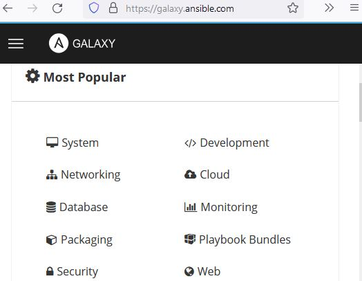

# Ansible Galaxy

### What is Ansible Galaxy?

 Ansible Galaxy is a galaxy website where users can share roles and to a command-line tool for **installing, creating,** and **managing** roles.



Ansible Galaxy gives greater visibility to one of Ansible's most exciting features, such as application installation or reusable roles for server configuration. Lots of people share roles in the Ansible Galaxy.

 To work with  Ansible Galaxy, you need to use the **ansible-galaxy** command and its templates. Roles must be downloaded before they used in the playbooks. They are placed into the default directory that is** /etc/ansible/roles, **also depends on your version, they might placed in your **current user** home directory.


If roles are stored in** /etc/ansible/roles** you have to have sudo access.


Currently we don't have any roles in default place:

```
[user1@controller demo-galaxy]$ ls /etc/ansible/roles/
```

### Search on Galaxy

`ansible-galaxy search` searches for roles on the Ansible Galaxy server. Lets search for apache for example:

```
[user1@controller demo-galaxy]$ ansible-galaxy search apache

Found 3237 roles matching your search. Showing first 1000.

 Name                                                          Description
 ----                                                          -----------
 0utsider.ansible_zabbix_agent                                 Installing and maintaining zabbix-agent for RedHat/Debian/Ubuntu.
 0x0i.elasticsearch                                            Elasticsearch, a real-time distributed search and analytics engine
 0x0i.kafka                                                    Kafka, a distributed and fault tolerant stream-processing platform
 0x0i.systemd                                                  Systemd, a system and service manager for Linux operating systems
 1it.docker-run                                                Ansible role to build and run docker containers docker-compose like style
 1it.riak                                                      Installs and configures Riak KV and TS, a distributed, highly available NoSQL and
 1nfinitum.php                                                 PHP installation role.
 4linuxdevops.web-server                                       Instalacao e Configuracao do servidor Apache
 5KYDEV0P5.common                                              Common Utilities and package installation for Linux
 5KYDEV0P5.skydevops-java                                      Installs and configures Oracle Java 1.8.x
 5KYDEV0P5.skydevops-maven                                     Install and configure Apache Mvaen 3.x.x
...
```

### Download from Galaxy

 Use the `ansible-galaxy install` command to download roles from the [Galaxy server](https://galaxy.ansible.com)

```
[user1@controller demo-galaxy]$ ansible-galaxy install geerlingguy.apache geerlingguy.mysql
- downloading role 'apache', owned by geerlingguy
- downloading role from https://github.com/geerlingguy/ansible-role-apache/archive/3.1.4.tar.gz
- extracting geerlingguy.apache to /home/user1/.ansible/roles/geerlingguy.apache
- geerlingguy.apache (3.1.4) was installed successfully
- downloading role 'mysql', owned by geerlingguy
- downloading role from https://github.com/geerlingguy/ansible-role-mysql/archive/3.3.2.tar.gz
- extracting geerlingguy.mysql to /home/user1/.ansible/roles/geerlingguy.mysql
- geerlingguy.mysql (3.3.2) was installed successfully
```

Lets take look at what it has downloaded:

```
[user1@controller demo-galaxy]$
[user1@controller demo-galaxy]$ ls /home/user1/.ansible/roles/
geerlingguy.apache  geerlingguy.mysql
[user1@controller demo-galaxy]$
[user1@controller demo-galaxy]$ cd /home/user1/.ansible/roles/
[user1@controller roles]$
[user1@controller roles]$ cd geerlingguy.apache/
[user1@controller geerlingguy.apache]$ ls
defaults  handlers  LICENSE  meta  molecule  README.md  tasks  templates  vars
[user1@controller demo-galaxy]$
[user1@controller geerlingguy.apache]$ cd ~/demo-galaxy/
[user1@controller demo-galaxy]$
```

For using  downloaded role, we have to create a simple playbook:

```
---
#Sample playbook for galaxy and roles galaxy-playbook.yaml

- hosts: all
  become: yes
  roles:

   - geerlingguy.apache
   - geerlingguy.mysql
```

and like always run it:

```
[user1@controller demo-galaxy]$ ansible-playbook galaxy-playbook.yaml

PLAY [all] *************************************************************************************************************************************

TASK [Gathering Facts] *************************************************************************************************************************
ok: [centos]
ok: [ubuntu]

TASK [geerlingguy.apache : Include OS-specific variables.] *************************************************************************************
ok: [ubuntu]
ok: [centos]

TASK [geerlingguy.apache : Include variables for Amazon Linux.] ********************************************************************************
skipping: [ubuntu]
skipping: [centos]

TASK [geerlingguy.apache : Define apache_packages.] ********************************************************************************************
ok: [ubuntu]
ok: [centos]

TASK [geerlingguy.apache : include_tasks] ******************************************************************************************************
included: /home/user1/.ansible/roles/geerlingguy.apache/tasks/setup-Debian.yml for ubuntu
included: /home/user1/.ansible/roles/geerlingguy.apache/tasks/setup-RedHat.yml for centos

TASK [geerlingguy.apache : Update apt cache.] **************************************************************************************************
changed: [ubuntu]

TASK [geerlingguy.apache : Ensure Apache is installed on Debian.] ******************************************************************************
ok: [ubuntu]

TASK [geerlingguy.apache : Ensure Apache is installed on RHEL.] ********************************************************************************
changed: [centos]

TASK [geerlingguy.apache : Get installed version of Apache.] ***********************************************************************************
ok: [centos]
ok: [ubuntu]

TASK [geerlingguy.apache : Create apache_version variable.] ************************************************************************************
ok: [ubuntu]
ok: [centos]

TASK [geerlingguy.apache : Include Apache 2.2 variables.] **************************************************************************************
skipping: [ubuntu]
skipping: [centos]

TASK [geerlingguy.apache : Include Apache 2.4 variables.] **************************************************************************************
ok: [ubuntu]
ok: [centos]

TASK [geerlingguy.apache : Configure Apache.] **************************************************************************************************
included: /home/user1/.ansible/roles/geerlingguy.apache/tasks/configure-Debian.yml for ubuntu
included: /home/user1/.ansible/roles/geerlingguy.apache/tasks/configure-RedHat.yml for centos

TASK [geerlingguy.apache : Configure Apache.] **************************************************************************************************
ok: [ubuntu] => (item={u'regexp': u'^Listen ', u'line': u'Listen 80'})

TASK [geerlingguy.apache : Enable Apache mods.] ************************************************************************************************
changed: [ubuntu] => (item=rewrite.load)
changed: [ubuntu] => (item=ssl.load)

TASK [geerlingguy.apache : Disable Apache mods.] ***********************************************************************************************

TASK [geerlingguy.apache : Check whether certificates defined in vhosts exist.] ****************************************************************

TASK [geerlingguy.apache : Add apache vhosts configuration.] ***********************************************************************************
changed: [ubuntu]

TASK [geerlingguy.apache : Add vhost symlink in sites-enabled.] ********************************************************************************
changed: [ubuntu]

TASK [geerlingguy.apache : Remove default vhost in sites-enabled.] *****************************************************************************
skipping: [ubuntu]

TASK [geerlingguy.apache : Configure Apache.] **************************************************************************************************
ok: [centos] => (item={u'regexp': u'^Listen ', u'line': u'Listen 80'})

TASK [geerlingguy.apache : Check whether certificates defined in vhosts exist.] ****************************************************************

TASK [geerlingguy.apache : Add apache vhosts configuration.] ***********************************************************************************
changed: [centos]

TASK [geerlingguy.apache : Check if localhost cert exists (RHEL 8 and later).] *****************************************************************
skipping: [centos]

TASK [geerlingguy.apache : Ensure httpd certs are installed (RHEL 8 and later).] ***************************************************************
skipping: [centos]

TASK [geerlingguy.apache : Ensure Apache has selected state and enabled on boot.] **************************************************************
ok: [centos]
ok: [ubuntu]

TASK [geerlingguy.mysql : include_tasks] *******************************************************************************************************
included: /home/user1/.ansible/roles/geerlingguy.mysql/tasks/variables.yml for ubuntu, centos

TASK [geerlingguy.mysql : Include OS-specific variables.] **************************************************************************************
ok: [ubuntu] => (item=/home/user1/.ansible/roles/geerlingguy.mysql/vars/Debian.yml)
ok: [centos] => (item=/home/user1/.ansible/roles/geerlingguy.mysql/vars/RedHat-7.yml)

TASK [geerlingguy.mysql : Define mysql_packages.] **********************************************************************************************
ok: [ubuntu]
ok: [centos]

TASK [geerlingguy.mysql : Define mysql_daemon.] ************************************************************************************************
ok: [ubuntu]
ok: [centos]

TASK [geerlingguy.mysql : Define mysql_slow_query_log_file.] ***********************************************************************************
ok: [ubuntu]
ok: [centos]

TASK [geerlingguy.mysql : Define mysql_log_error.] *********************************************************************************************
ok: [ubuntu]
ok: [centos]

TASK [geerlingguy.mysql : Define mysql_syslog_tag.] ********************************************************************************************
ok: [ubuntu]
ok: [centos]

TASK [geerlingguy.mysql : Define mysql_pid_file.] **********************************************************************************************
ok: [ubuntu]
ok: [centos]

TASK [geerlingguy.mysql : Define mysql_config_file.] *******************************************************************************************
ok: [ubuntu]
ok: [centos]

TASK [geerlingguy.mysql : Define mysql_config_include_dir.] ************************************************************************************
ok: [ubuntu]
ok: [centos]

TASK [geerlingguy.mysql : Define mysql_socket.] ************************************************************************************************
ok: [ubuntu]
ok: [centos]

TASK [geerlingguy.mysql : Define mysql_supports_innodb_large_prefix.] **************************************************************************
ok: [ubuntu]
ok: [centos]

TASK [geerlingguy.mysql : include_tasks] *******************************************************************************************************
skipping: [ubuntu]
included: /home/user1/.ansible/roles/geerlingguy.mysql/tasks/setup-RedHat.yml for centos

TASK [geerlingguy.mysql : Ensure MySQL packages are installed.] ********************************************************************************
changed: [centos]

TASK [geerlingguy.mysql : include_tasks] *******************************************************************************************************
skipping: [centos]
included: /home/user1/.ansible/roles/geerlingguy.mysql/tasks/setup-Debian.yml for ubuntu

TASK [geerlingguy.mysql : Check if MySQL is already installed.] ********************************************************************************
ok: [ubuntu]

TASK [geerlingguy.mysql : Update apt cache if MySQL is not yet installed.] *********************************************************************
changed: [ubuntu]

TASK [geerlingguy.mysql : Ensure MySQL Python libraries are installed.] ************************************************************************
changed: [ubuntu]

TASK [geerlingguy.mysql : Ensure MySQL packages are installed.] ********************************************************************************
changed: [ubuntu]

TASK [geerlingguy.mysql : Ensure MySQL is stopped after initial install.] **********************************************************************
changed: [ubuntu]

TASK [geerlingguy.mysql : Delete innodb log files created by apt package after initial install.] ***********************************************
changed: [ubuntu] => (item=ib_logfile0)
changed: [ubuntu] => (item=ib_logfile1)

TASK [geerlingguy.mysql : include_tasks] *******************************************************************************************************
skipping: [ubuntu]
skipping: [centos]

TASK [geerlingguy.mysql : Check if MySQL packages were installed.] *****************************************************************************
ok: [ubuntu]
ok: [centos]

TASK [geerlingguy.mysql : include_tasks] *******************************************************************************************************
included: /home/user1/.ansible/roles/geerlingguy.mysql/tasks/configure.yml for ubuntu, centos

TASK [geerlingguy.mysql : Get MySQL version.] **************************************************************************************************
ok: [ubuntu]
ok: [centos]

TASK [geerlingguy.mysql : Copy my.cnf global MySQL configuration.] *****************************************************************************
changed: [ubuntu]
changed: [centos]

TASK [geerlingguy.mysql : Verify mysql include directory exists.] ******************************************************************************
skipping: [ubuntu]
skipping: [centos]

TASK [geerlingguy.mysql : Copy my.cnf override files into include directory.] ******************************************************************

TASK [geerlingguy.mysql : Create slow query log file (if configured).] *************************************************************************
skipping: [ubuntu]
skipping: [centos]

TASK [geerlingguy.mysql : Create datadir if it does not exist] *********************************************************************************
changed: [ubuntu]
ok: [centos]

TASK [geerlingguy.mysql : Set ownership on slow query log file (if configured).] ***************************************************************
skipping: [ubuntu]
skipping: [centos]

TASK [geerlingguy.mysql : Create error log file (if configured).] ******************************************************************************
skipping: [ubuntu]
skipping: [centos]

TASK [geerlingguy.mysql : Set ownership on error log file (if configured).] ********************************************************************
skipping: [ubuntu]
skipping: [centos]

TASK [geerlingguy.mysql : Ensure MySQL is started and enabled on boot.] ************************************************************************
changed: [ubuntu]
changed: [centos]

TASK [geerlingguy.mysql : include_tasks] *******************************************************************************************************
included: /home/user1/.ansible/roles/geerlingguy.mysql/tasks/secure-installation.yml for ubuntu, centos

TASK [geerlingguy.mysql : Ensure default user is present.] *************************************************************************************
skipping: [ubuntu]
skipping: [centos]

TASK [geerlingguy.mysql : Copy user-my.cnf file with password credentials.] ********************************************************************
skipping: [ubuntu]
skipping: [centos]

TASK [geerlingguy.mysql : Disallow root login remotely] ****************************************************************************************
ok: [ubuntu] => (item=DELETE FROM mysql.user WHERE User='root' AND Host NOT IN ('localhost', '127.0.0.1', '::1'))
ok: [centos] => (item=DELETE FROM mysql.user WHERE User='root' AND Host NOT IN ('localhost', '127.0.0.1', '::1'))

TASK [geerlingguy.mysql : Get list of hosts for the root user.] ********************************************************************************
ok: [ubuntu]
ok: [centos]

TASK [geerlingguy.mysql : Update MySQL root password for localhost root account (5.7.x).] ******************************************************
skipping: [centos] => (item=127.0.0.1)
skipping: [centos] => (item=::1)
skipping: [centos] => (item=localhost)
changed: [ubuntu] => (item=localhost)

TASK [geerlingguy.mysql : Update MySQL root password for localhost root account (< 5.7.x).] ****************************************************
skipping: [ubuntu] => (item=localhost)
changed: [centos] => (item=127.0.0.1)
changed: [centos] => (item=::1)
changed: [centos] => (item=localhost)

TASK [geerlingguy.mysql : Copy .my.cnf file with root password credentials.] *******************************************************************
changed: [ubuntu]
changed: [centos]

TASK [geerlingguy.mysql : Get list of hosts for the anonymous user.] ***************************************************************************
ok: [ubuntu]
ok: [centos]

TASK [geerlingguy.mysql : Remove anonymous MySQL users.] ***************************************************************************************
changed: [centos] => (item=centos.example.com)
changed: [centos] => (item=localhost)
[WARNING]: Module did not set no_log for update_password

TASK [geerlingguy.mysql : Remove MySQL test database.] *****************************************************************************************
changed: [centos]
ok: [ubuntu]

TASK [geerlingguy.mysql : include_tasks] *******************************************************************************************************
included: /home/user1/.ansible/roles/geerlingguy.mysql/tasks/databases.yml for ubuntu, centos

TASK [geerlingguy.mysql : Ensure MySQL databases are present.] *********************************************************************************

TASK [geerlingguy.mysql : include_tasks] *******************************************************************************************************
included: /home/user1/.ansible/roles/geerlingguy.mysql/tasks/users.yml for ubuntu, centos

TASK [geerlingguy.mysql : Ensure MySQL users are present.] *************************************************************************************
skipping: [ubuntu]
skipping: [centos]

TASK [geerlingguy.mysql : include_tasks] *******************************************************************************************************
included: /home/user1/.ansible/roles/geerlingguy.mysql/tasks/replication.yml for ubuntu, centos

TASK [geerlingguy.mysql : Ensure replication user exists on master.] ***************************************************************************
skipping: [ubuntu]
skipping: [centos]

TASK [geerlingguy.mysql : Check slave replication status.] *************************************************************************************
skipping: [ubuntu]
skipping: [centos]

TASK [geerlingguy.mysql : Check master replication status.] ************************************************************************************
skipping: [ubuntu]
skipping: [centos]

TASK [geerlingguy.mysql : Configure replication on the slave.] *********************************************************************************
skipping: [ubuntu]
skipping: [centos]

TASK [geerlingguy.mysql : Start replication.] **************************************************************************************************
skipping: [ubuntu]
skipping: [centos]

RUNNING HANDLER [geerlingguy.apache : restart apache] ******************************************************************************************
changed: [ubuntu]
changed: [centos]

RUNNING HANDLER [geerlingguy.mysql : restart mysql] ********************************************************************************************
[WARNING]: Ignoring "sleep" as it is not used in "systemd"
[WARNING]: Ignoring "sleep" as it is not used in "systemd"
changed: [ubuntu]
changed: [centos]

PLAY RECAP *************************************************************************************************************************************
centos                     : ok=45   changed=11   unreachable=0    failed=0    skipped=23   rescued=0    ignored=0
ubuntu                     : ok=52   changed=16   unreachable=0    failed=0    skipped=24   rescued=0    ignored=0
```

and it runs tons of tasks. 

### Upload to Galaxy

To upload a role to ansibel galaxy, first you have to upload it to your github project and next log in to your ansible galaxy account and pull that, That's all.

.

.

.

[https://www.redhat.com/sysadmin/ansible-galaxy-intro](https://www.redhat.com/sysadmin/ansible-galaxy-intro)

[https://www.javatpoint.com/ansible-galaxy](https://www.javatpoint.com/ansible-galaxy)

[https://docs.ansible.com/ansible/latest/cli/ansible-galaxy.html](https://docs.ansible.com/ansible/latest/cli/ansible-galaxy.html)

[https://galaxy.ansible.com/docs/using/installing.html](https://galaxy.ansible.com/docs/using/installing.html)

.

