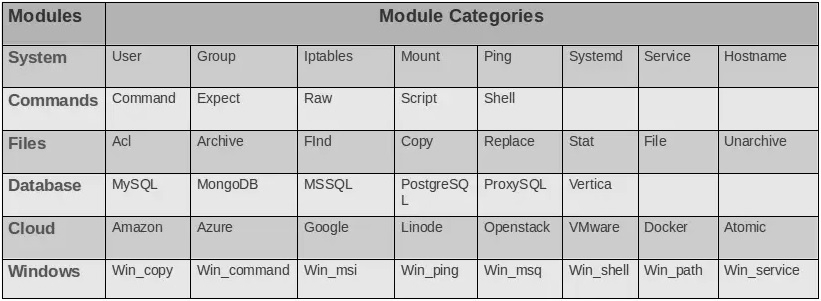

# Ansible Modules

 In order to develop more meaningful Playbooks, we need to know more about Ansible Modules.

### What is  Ansible  Module?

 Ansible works by connecting to your nodes and pushing out small programs, called modules to them. Modules are used to accomplish automation tasks in Ansible.

These programs are written to be resource models of the desired state of the system. Ansible then executes these modules and removes them when finished.

**Ansible** modules are categorized into various groups based on their functionality. There are hundreds of **Ansible** modules are available. We have categorized all the modules as shown in the below image:



1. **System :** System modules are actions to be performed at a system level such as modifying the users and groups on the system, modifying iptables and firewall configurations, working with logical volume groups, mounting operations and working with services.
2. **Command :** Command module are used to execute command or script on the host. This could be a simple command using the command module or an interactive execution using expect by responding to prompts. You could also run a script on the host using the script module.
3. **Files :** Files module will help in working with files. For example, using an ACL module to set an acl information on files, use the archive and unarchive module to compress and unpack files, use find, line in file, and replace the module to modify the contents of an existing file.
4. **Database :** Database module helps in working with databases such as mongodb, mysql, mssql, postgresql, proxysql and vertica to add or remove databases or modifying database configurations, etc.
5. **Cloud :** The Cloud section has a vast collection of modules for different cloud providers like Amazon, Azure, Google, Docker, VMware, Digital Ocean, Openstack, and many more. There are number a of modules available of each of these that allow you to perform various tasks such as, creating and destroying instances, performing configuration changes, security, managing containers, clusters, and much more.
6. **Windows :** Windows module helps you in the Windows environment. Some of them are, Win\_copy to copy files, Win\_command to execute a command, configuring a domain, configuring IIS, configuring registry, and lot more.

A module provides a defined interface, accepts arguments, and returns information to Ansible by printing a JSON string to stdout before exiting. Lets take a look at command module for example.

### command module

Command Modules  executes a command on a remote node, it is good to know that command module is a default module if no modules is specified.

| **Parameter** | Comments |
| :--- | :--- |
| **chdir** | cd into this directory before running the command |
| **creates** | a filename or \(since 2.0\) glob pattern, when it already exists, this step **will not** be run |
| **executable** | change the shell used to execute the command. Should be an absolute path to the executable |
| **free\_form** | the command module takes a free form command to run. There is no parameter actually named 'free form'. see the examples! |
| **removes** | a filename or \(since 2.0\) glob pattern, when it does not exist, this step **will not** be run. |
| **warn** \(added in1.8\) | if command warnings are on in ansible.cfg, do not warn about this particular line if set to no/false. |

```text
---
# Simple ansible playbook command-playbook.yml
-
  name: Play commands
  hosts: localhost
  tasks:
     - name: Execute command 'date'
       command: date

     - name: Display resolv.conf contents
       command: cat /etc/resolv.conf

     - name: Display resolv.conf contents using chdir
       command: cat resolv.conf chdir=/etc

     - name: Create a directory
       command: mkdir /home/user1/demo-module/folder
```


`free_form`indicates that this module takes a **free form** **command** to run. Like  `cat resolv.conf` or `mkdir /folder` in  above example. Not all modules support input like this, like copy module.


### script module

Runs a local script on one or more remote node\(s\) after transferring it.

```text
---
#Sample Ansible script-playbook.yml
-
  name: Play Scripts
  hosts: localhost
  tasks:
    - name: Run a script on remote server
      script: /home/user1/demo-module/script.sh
```

### service module

Used to manage services on a system, Start, Stop, Restart. The Service module  **does not have** a **free\_form** input, which means we have to pass input in a key value pair format.

```text
---
#Sample Ansible service-playbook1.yml
-
  name: Start some Services in order
  hosts: centos
  tasks:
    - name: Start the database service
      service: name=postgresql state=started
      
    - name: Start the httpd service
      service: name=httpd state=started
```

 also we  can write above playbook  it in a dictionary or map format like this:

```text
---
#Sample Ansible service-playbook2.yml
-
  name: Start some Services in order
  hosts: centos
  tasks:
    - name: Start the database service
      service:
         name: postgresql
         state: started
         
    - name: Start the httpd service
      service:
         name: httpd
         state: started
```

`started`ensures that `httpd` service is started, so if it is already started, do nothing. As we mentioned before, this is called idempotency.


Majority of the modules in Ansible are idempotent and Ansible highly recommends this. The overall idea is that you should be able to run the same playbook again and again and Ansible should report that everything is in an expected state.


### lineinfile Module

Lineinfile module is used to find a line in a file and replace it or add it if it doesn't already exist.

```text
---
#Sample Ansible Playbook-lineinfile.yml
-
  name: Add DNS server
  hosts: localhost
  tasks:
    -  name: Add DNS server to resolv.conf
       lineinfile:
         path: /etc/resolv.conf
         line: 'nameserver 8.8.8.8'
```

What if we do the same thing using a script and run it multiple times?

### mail module

This module is useful for sending emails from playbooks.

```
---
#Sample Ansible Playbook-mail.yml
-
  name: sending mail 
  hosts: localhost
  tasks:
    - name: sending mail to root
      mail:
         subject: 'System has been successfully configured'
      delegate_to: localhost
       
    - name: Sending an e-mail using Gmail SMTP servers
      mail:
        host: smtp.gmail.com
        port: 587
        username: username@gmail.com
        password: mysecret
        to: John Smith <john.smith@example.com>
        subject: Ansible-report
        body: 'System has been successfully provisioned.'
      delegate_to: localhost
    
    - name: sendMail to a mail server with attachments
      mail:
        host: smtp.example.com
        port: 465
        username: payam@example.com
        password: P@sswd
        from: payam@example.com
        to: jadi@example.com
        attach: /etc/fstab /etc/hosts
        subject: Ansible-report
        body: 'System  has been successfully provisioned.'
       
 

```

### yum module

Installs, upgrade, downgrades, removes, and lists packages and groups with the _yum_ package manager.

```text
---
#Sample Ansible Playbook-yum.yml
-
  name: Install package(s) using yum
  hosts: localhost
  tasks:
    - name: Install the latest version of Apache
      yum:
        name: httpd
        state: latest

    - name: Install Apache >= 2.4
      yum:
        name: httpd>=2.4
        state: present
        
    - name: Install a list of packages
      yum:
        name: Install nginx and postgresql
          - nginx
          - postgresql
          - postgresql-server
        state: present
```


Always check the ansible official documents for the latest changes.


### firewall module

This module allows for addition or deletion of services and ports \(either TCP or UDP\) in either running or permanent firewalld rules.

```text
---
#Sample Ansible Playbook-firewalld.yml
-
  name: Set Firewall Configurations
  hosts: web
  tasks:
    -  firewalld:
         service: https
         permanent: true
         state: enabled
    
    -  firewalld:
         port: 8080/tcp
         permanent: true
         state: disabled
         
    -  firewalld:
         port: 162-162/udp
         permanent: true
         state: disabled
         
    -  firewalld:
         source: 192.168.100.0/24
         zone: internal
         state: enabled     
```

.

.

.

With the special thanks of mumshad mannambeth.

[https://www.redhat.com/en/topics/automation/learning-ansible-tutorial](https://www.redhat.com/en/topics/automation/learning-ansible-tutorial)

[https://linuxbuz.com/linuxhowto/what-is-ansible-modules-and-how-to-use-it](https://linuxbuz.com/linuxhowto/what-is-ansible-modules-and-how-to-use-it)

[https://docs.ansible.com/ansible/2.8/modules/command\_module.html](https://docs.ansible.com/ansible/2.8/modules/command_module.html)

[https://docs.ansible.com/ansible/2.4/script\_module.html](https://docs.ansible.com/ansible/2.4/script_module.html)

[https://docs.ansible.com/ansible/2.5/modules/service\_module.html](https://docs.ansible.com/ansible/2.5/modules/service_module.html)

[https://docs.ansible.com/ansible/2.5/modules/lineinfile\_module.html](https://docs.ansible.com/ansible/2.5/modules/lineinfile_module.html)

[https://docs.ansible.com/ansible/2.3/mail\_module.html](https://docs.ansible.com/ansible/2.3/mail_module.html)

[https://docs.ansible.com/ansible/latest/collections/ansible/builtin/yum\_module.html](https://docs.ansible.com/ansible/latest/collections/ansible/builtin/yum_module.html)

[https://docs.ansible.com/ansible/latest/collections/ansible/posix/firewalld\_module.html](https://docs.ansible.com/ansible/latest/collections/ansible/posix/firewalld_module.html)

.


