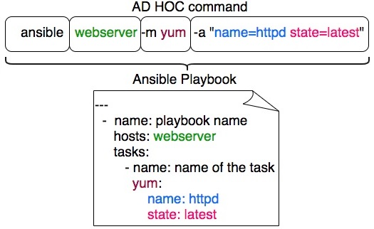
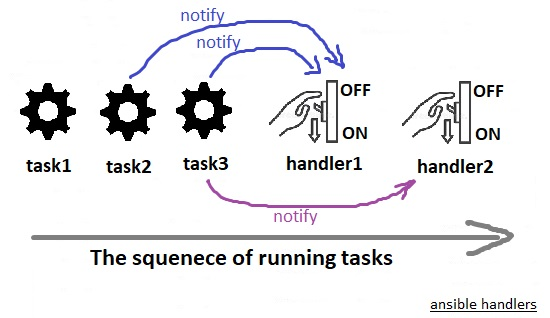

# Ansible Playbooks

### What is Ansible Playbook? 

**Ansible Playbooks** are the way of sending commands to remote systems through scripts. Ansible playbooks are used to configure complex system environments to increase flexibility by executing a script to one or more systems. 

An Ansible Playbook can be as simple as running a series of commands on different server in sequence and restarting those servers in a particular order, or it could be as complex as deploying hundreds of VMs in a public and private cloud infrastructure!

```
---

  - name: Simple Playbook
    hosts: webservers
    tasks:
      - name: ensure apache is at the latest version
        yum:
          name: httpd
          state: latest
```


Ansible playbooks tend to be more of a configuration language than a programming language. Ansible playbook commands use** YAML** format. 

* **Playbook **-A single **YAML** file
  * **Play **- Defines a set of activities (tasks) to be run on hosts
    * **Task **- An action to be performed on the host. examples:
      * Execute a command
      * Run a script
      * Install a package
      * Shutdown/Restart


### Sample Ansible Playbooks

Here we have a simple ansible Playbook, which helps you to get the idea:

```
---

#Sample Ansible Playbook1.yml
-
  name: Play1
  hosts: centos
  tasks:
    - name : Execute command 'date'
      command: date
      
    - name : Execute script on server
      script: my_script.sh
      
    - name : Install httpd service
      yum:
        name: httpd
        state: present
      
    - name : Start web server
      service:
        name: httpd
        state: started
```

Remember the host we want to perform these operations against is always set at a play level. You could have any host or groups specified here but you must ensure that the host or group is first defined in the inventory file we created earlier. The host defined in the inventory file must match the host used in the Playbook . 


All connection information for the host is retrieved from the inventory file. There is no hard rule to use all the hosts defined in the inventory file. We can choose one or multiple or a group or multiple groups from the inventory file in the play.


 We can also split the list of tasks into two separate plays (using our YAML skills):

```
---

#Sample Ansible Playbook2.yml
-
  name: Play1
  hosts: centos
  tasks:
    - name : Execute command 'date'
      command: date
      
    - name : Execute script on server
      script: my_script.sh

-
  name: Play2
  hosts: centos
  tasks:
    - name : Install httpd service
      yum:
        name: httpd
        state: present
      
    - name : Start web server
      service:
        name: httpd
        state: started
```

The` '-'` indicates that it is an item in the list. So the Playbook is a list of dictionaries. Each play is a dictionary and has a set of properties called **name**, **hosts **and **tasks **. Remember these are properties of a dictionary  and so the order doesn't really matter. So even if you swap the position of name and hosts, it's still a valid play. 

How ever this is not the same for tasks. The tasks is a list as denoted by the dashes. List are ordered collections, So the position of entries matter. Swapping the position of entries here, really matters.

The different actions run by tasks are called modules. In our example, command, script, yum and service are Ansible Modules. There hundreds of other modules available. We will talk about them later.  


The YAML format is key while developing Playbooks. We must pay extra attention to the indentation and structure of this file. For testing yaml files:

* web site: [http://www.yamllint.com/](http://www.yamllint.com)
* ATOM ide with linter-js-yaml and remote-sync (if you need)


###  Running Ansible

There are Two ways of running Ansible:

* **`ansible `**command (**ad-hoc commands**) : Used when we want to use ansible for One task, such as Testing connectivity between ansible controller and target, Shutting down a set of server, ... . In that case we can run ansible with out writing a playbook.
* **`ansible-playbook`** command : used when you have a playbook.



| ansible (Imperative)                | ansible-playbook (Declarative)        |
| ----------------------------------- | ------------------------------------- |
| **ansible** \<host> -a \<command>   | **ansible-playbook** \<playbook name> |
| **ansible** all -a '''/sbin/reboot' |                                       |
| **ansible** \<host> -m \<module>    |                                       |
| **ansible** target1 -m ping         |                                       |

### Demo - Running Ansible 

We have already talked about ad-hoc commands, so go back for more examples:

```
[user1@controller demo-playbook]$  ansible all -m ping
centos | SUCCESS => {
    "ansible_facts": {
        "discovered_interpreter_python": "/usr/bin/python"
    },
    "changed": false,
    "ping": "pong"
}
ubuntu | SUCCESS => {
    "ansible_facts": {
        "discovered_interpreter_python": "/usr/bin/python3"
    },
    "changed": false,
    "ping": "pong"
}
```

### Demo - Running ansible playbooks

Lets do the same thing using  a playbook:

```
---

#ping-playbook.yaml
-
  name: Test Connectivity
  hosts: all
  tasks:
    - name: Ping test
      ping:
```

```
[user1@controller demo-playbook]$ ansible-playbook ping-playbook.yaml

PLAY [Test Connectivity] ****************************************************************************************************************

TASK [Gathering Facts] ******************************************************************************************************************
ok: [centos]
ok: [ubuntu]

TASK [Ping test] ************************************************************************************************************************
ok: [centos]
ok: [ubuntu]

PLAY RECAP ******************************************************************************************************************************
centos                     : ok=2    changed=0    unreachable=0    failed=0    skipped=0    rescued=0    ignored=0
ubuntu                     : ok=2    changed=0    unreachable=0    failed=0    skipped=0    rescued=0    ignored=0
```

_We do not need to any hosts here, because we have specified the hosts inside the playbook._

As second example lets create a new playbook using copy module, to copy some files to target systems. Always use ansible documentations it has good examples

```
### Creating a test file
[user1@controller demo-playbook]$ cat > /tmp/test-file.txt
Sample Text File!!!
^C
```

```
---

# Sample copy playbook!

-
  name: Copy file to target server(s)
  hosts: all
  tasks:
    - name:  Copy file
      copy:
        src: /tmp/test-file.txt
        dest: /tmp/test-file.txt
```

```
[user1@controller demo-playbook]$ ansible-playbook copy-playbook.yaml

PLAY [Copy file to target server(s)] ****************************************************************************************************

TASK [Gathering Facts] ******************************************************************************************************************
ok: [centos]
ok: [ubuntu]

TASK [Copy file] ************************************************************************************************************************
changed: [centos]
changed: [ubuntu]

PLAY RECAP ******************************************************************************************************************************
centos                     : ok=2    changed=1    unreachable=0    failed=0    skipped=0    rescued=0    ignored=0
ubuntu                     : ok=2    changed=1    unreachable=0    failed=0    skipped=0    rescued=0    ignored=0
```

If you check the target server(s) you would see the test-file is now there. 

```
root@ubuntu:~# su - user1
$ cat /tmp/test-file.txt
Sample Text File!!!
$
```

Know if we execute the playbook again what will happened?  Copy the files? Over write it? Or just leave it as it is because the file is over there?

```
[user1@controller demo-playbook]$ ansible-playbook copy-playbook.yaml

PLAY [Copy file to target server(s)] ****************************************************************************************************

TASK [Gathering Facts] ******************************************************************************************************************
ok: [centos]
ok: [ubuntu]

TASK [Copy file] ************************************************************************************************************************
ok: [centos]
ok: [ubuntu]

PLAY RECAP ******************************************************************************************************************************
centos                     : ok=2    changed=0    unreachable=0    failed=0    skipped=0    rescued=0    ignored=0
ubuntu                     : ok=2    changed=0    unreachable=0    failed=0    skipped=0    rescued=0    ignored=0
```

As we said Ansible is smart enough and detects that the file is over there and does not change any thing. And that is the concept of Ansible Idempotency.


**Idempotency:** In simple words, Ansible only makes a change if it has to, if it is already in the same state then it really doesn't make the change. So we can run the ansible playbook as many time as we want, it is only going to make a change when there is a need.


 Use  `ansible-playbook` with** -v** or** --verbose **switches to get more information, use **-vv** or even** -vvv **for more information. **-vvvv**  enables connection debugging!

###  Privilege Escalation

We have already get familiar with privilege escalation concept and why we need that. First lets run a sample playbook with out escalating privileges and see the results:

```
---

# Sample whoami-playbook.yaml

 - hosts: all
   tasks:
       - name: do a uname
         shell: uname -a > /home/user1/results.txt

       - name: whoami
         shell: whoami >> /home/user1/results.txt
```

```
[user1@controller demo-playbook]$ ansible-playbook whoami-playbook.yaml

PLAY [all] ******************************************************************************************************************************

TASK [Gathering Facts] ******************************************************************************************************************
ok: [centos]
ok: [ubuntu]

TASK [do a uname] ***********************************************************************************************************************
changed: [centos]
changed: [ubuntu]

TASK [whoami] ***************************************************************************************************************************
changed: [ubuntu]
changed: [centos]

PLAY RECAP ******************************************************************************************************************************
centos                     : ok=3    changed=2    unreachable=0    failed=0    skipped=0    rescued=0    ignored=0
ubuntu                     : ok=3    changed=2    unreachable=0    failed=0    skipped=0    rescued=0    ignored=0
```

and the results:

```
###on ubuntu :
user1@ubuntu:~$ cat results.txt
Linux ubuntu 5.4.0-42-generic #46~18.04.1-Ubuntu SMP Fri Jul 10 07:21:24 UTC 2020 x86_64 x86_64 x86_64 GNU/Linux
user1

### on centos:
[user1@centos ~]$ cat results.txt
Linux centos.example.com 3.10.0-1127.el7.x86_64 #1 SMP Tue Mar 31 23:36:51 UTC 2020 x86_64 x86_64 x86_64 GNU/Linux
user1
```

There are two different ways we can run this as root:

* use** -b** switch while running playbook: `ansible-playbook -b <playbook.yaml>`
* add a line **become: yes **or **become: true**  inside playbook. 

```
---

# Sample whoami-playbook.yaml

 - hosts: all
   become: true
   tasks:
       - name: do a uname
         shell: uname -a > /home/user1/results.txt

       - name: whoami
         shell: whoami >> /home/user1/results.txt
```

Now run it again and check the results:

```
[user1@controller demo-playbook]$ ansible-playbook whoami-playbook.yaml

PLAY [all] ******************************************************************************************************************************

TASK [Gathering Facts] ******************************************************************************************************************
ok: [centos]
ok: [ubuntu]

TASK [do a uname] ***********************************************************************************************************************
changed: [ubuntu]
changed: [centos]

TASK [whoami] ***************************************************************************************************************************
changed: [ubuntu]
changed: [centos]

PLAY RECAP ******************************************************************************************************************************
centos                     : ok=3    changed=2    unreachable=0    failed=0    skipped=0    rescued=0    ignored=0
ubuntu                     : ok=3    changed=2    unreachable=0    failed=0    skipped=0    rescued=0    ignored=0
```

```
### ubuntu
user1@ubuntu:~$ cat results.txt
Linux ubuntu 5.4.0-42-generic #46~18.04.1-Ubuntu SMP Fri Jul 10 07:21:24 UTC 2020 x86_64 x86_64 x86_64 GNU/Linux
root

### centos
[user1@centos ~]$ cat results.txt
Linux centos.example.com 3.10.0-1127.el7.x86_64 #1 SMP Tue Mar 31 23:36:51 UTC 2020 x86_64 x86_64 x86_64 GNU/Linux
root
```

use` `**`become_user`** the user name that we want to switch to like compare it with `sudo su - user `.


### Handlers

Sometimes you want a task to run only when a change is made on a machine. For example, you may want to start a service if a task updates the configuration of that service, but not if the configuration is unchanged. Ansible uses handlers to address this use case. **Handlers are tasks that only run when notified.** If a handler get notified multiple times, it just runs once. Each handler should have a globally unique name.



As an example lets install vsftp , vsftp is the name of the package on both ubuntu and centos:

```
---

### sample handler-playbook.yaml

- hosts: all
  become: yes
  tasks:
    - name: install vsftpd on ubuntu
      apt: name=vsftpd update_cache=yes state=latest
      ignore_errors: yes
      notify: start vsftpd

    - name: install vsftpd on centos
      yum: name=vsftpd state=latest
      ignore_errors: yes
      notify: start vsftpd

  handlers:
    - name: start vsftpd
      service: name=vsftpd enabled=yes state=started
```

As there is no apt on centos, **`ignore_error`** cause playbook continue running other tasks even if this task fails. So if there is an error keep going!

```
[user1@controller demo-playbook]$ ansible-playbook handler-playbook.yaml

PLAY [all] ******************************************************************************************************************************

TASK [Gathering Facts] ******************************************************************************************************************
ok: [centos]
ok: [ubuntu]

TASK [install vsftpd on ubuntu] *********************************************************************************************************
[WARNING]: Updating cache and auto-installing missing dependency: python-apt
fatal: [centos]: FAILED! => {"changed": false, "cmd": "apt-get update", "msg": "[Errno 2] No such file or directory", "rc": 2}
...ignoring
changed: [ubuntu]

TASK [install vsftpd on centos] *********************************************************************************************************
ok: [ubuntu]
changed: [centos]

RUNNING HANDLER [start vsftpd] **********************************************************************************************************
ok: [ubuntu]
changed: [centos]

PLAY RECAP ******************************************************************************************************************************
centos                     : ok=4    changed=2    unreachable=0    failed=0    skipped=0    rescued=0    ignored=1
ubuntu                     : ok=4    changed=1    unreachable=0    failed=0    skipped=0    rescued=0    ignored=0

```

and lets run it again!

```
[user1@controller demo-playbook]$ ansible-playbook handler-playbook.yaml

PLAY [all] ******************************************************************************************************************************

TASK [Gathering Facts] ******************************************************************************************************************
ok: [centos]
ok: [ubuntu]

TASK [install vsftpd on ubuntu] *********************************************************************************************************
[WARNING]: Updating cache and auto-installing missing dependency: python-apt
fatal: [centos]: FAILED! => {"changed": false, "cmd": "apt-get update", "msg": "[Errno 2] No such file or directory", "rc": 2}
...ignoring
ok: [ubuntu]

TASK [install vsftpd on centos] *********************************************************************************************************
ok: [ubuntu]
ok: [centos]

PLAY RECAP ******************************************************************************************************************************
centos                     : ok=3    changed=0    unreachable=0    failed=0    skipped=0    rescued=0    ignored=1
ubuntu                     : ok=3    changed=0    unreachable=0    failed=0    skipped=0    rescued=0    ignored=0
```

and this time no `RUNNING HANDLER [start vsftpd] `if you have noticed! Because there is no changes made.

.

.

.

.

[https://docs.ansible.com/ansible/latest/collections/ansible/builtin/copy_module.html](https://docs.ansible.com/ansible/latest/collections/ansible/builtin/copy_module.html)

[https://docs.ansible.com/ansible/latest/user_guide/playbooks_handlers.html](https://docs.ansible.com/ansible/latest/user_guide/playbooks_handlers.html)

[https://www.middlewareinventory.com/blog/ansible-playbook-example/](https://www.middlewareinventory.com/blog/ansible-playbook-example/)

[https://www.middlewareinventory.com/blog/ansible-sudo-ansible-become-example/](https://www.middlewareinventory.com/blog/ansible-sudo-ansible-become-example/)

.
