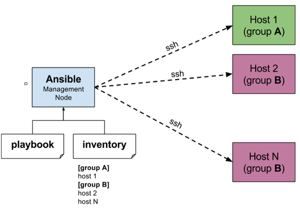
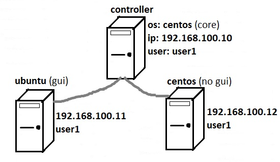

# Basic Concepts

### Whats is configuration management?

Configuration management is a process for maintaining computer systems, servers, and software in a desired, consistent state. It’s a way to make sure that a system performs as it’s expected to as changes are made over time.

Managing IT system configurations involves defining a system's desired state (like server configuration), and then building and maintaining those systems.

### Why manage configurations?

Configuration management keeps us away  from making small or large changes that doesn't have any documentation. If we let  these undocumented changes find their ways to our production systems, they  can lead to poor performance or inconsistencies  and negatively  could impact  our business . 

Manually identifying systems  requires  attention, knowing rollback scenarios, prioritizing actions, and validating completion which  are too complicated . Without documentation, doing a small change could end up not knowing what’s on a server or which software has been updated.

Configuration management systems let us consistently define system settings, as well as build and maintain those systems according to those baseline settings. Configuration management helps users and administrators know where certain services exist and what the current state of applications are.

#### Configuration management benefits

* Classify and manage systems by groups and subgroups. 
* Centrally modify base configurations.
* Roll out new settings to all applicable systems. 
* Automate system identification, patches, and updates
* Identify outdated, poor performing, and noncompliant configurations. 
* Prioritize actions. 
* Access and apply prescriptive remediation.

### What is Ansible?

Ansible is an open source IT automation engine that automates provisioning, configuration management, application deployment, orchestration, and many other IT processes.

Use Ansible automation to install software, automate daily tasks, provision infrastructure, improve security and compliance, patch systems, and share automation across your organization.

### History of Ansible

Here, are important land marks from the history of ansible:

* In February 2012 the Ansible project began. It was first developed by Michael DeHaan, the creator of [Cobbler ](https://cobbler.github.io)and Func(Fedora Unified Network Controller).
* Initially called AnsibleWorks Inc, the company funding the ansible tool was acquired in 2015 by RedHat and later on, along with RedHat, moved under the umbrella of IBM.
* In the present, Ansible comes included in distributions like Fedora Linux, RHEL, Centos and Oracle Linux.

### How Ansible Works?

**Ansible works** by connecting to your nodes and pushing out small programs, called "**Ansible** **modules**" to them. **Ansible** then executes these modules (**over SSH by default**), and removes them when finished. Your library of modules can reside on any machine, and there are no servers, daemons, or databases required.



* The **Management node** in the above picture is the **controlling node** (managing node) which controls the entire execution of the playbook. It’s the node from which you are running the installation.
*  **Playbooks **are ordered lists of tasks, saved so you can run those tasks in that order repeatedly. 
* The** inventory file** provides the list of hosts where the Ansible modules needs to be run and the management node does a SSH connection and executes the small modules on the hosts machine and installs the product/software.

>  Beauty of Ansible is that it removes the modules once those are installed so effectively it connects to host machine , executes the instructions and if it’s successfully installed removes the code which was copied on the host machine which was executed.

### Installation Process

Mainly, there are two types of machines when we talk about deployment −

* **Control machine** − Machine from where we can manage other machines.
* **Remote machine** − Machines which are handled/controlled by control machine.

There can be multiple remote machines which are handled by one control machine. So, for managing remote machines we have to install Ansible on control machine.

**Control node requirements are the following:**

* Python 2 (version 2.7) or Python 3 (versions 3.5 and higher) installed
* Windows is not supported as a control node, but you can set it up on Windows 10 using [WSL](https://docs.microsoft.com/en-us/windows/wsl/install-win10)
* Managed nodes also need Python to be installed.

```
#RHEL and CentOS
sudo yum install ansible
```

```
#Debian based distros
sudo apt update
sudo apt install software-properties-common
sudo apt-add-repository --yes --update ppa:ansible/ansible
sudo apt install ansible
```

After running the above line of code, you are ready to manage remote machines through Ansible. Just run `Ansible–version` to check the version and just to check whether Ansible was installed properly or not. You can also use below command:

```
[root@control1 ~]# ansible localhost -m ping
localhost | SUCCESS => {
    "changed": false,
    "ping": "pong"
}
```

it is okey if you don't know what i have done here!:)

### Lab Environment

For demonstration purpose , Lets setup a simple lab environment 



we use 3 workstations, one as controller node (centos7 core without gui) and first target is an ubuntu18 machine (with gui) and third is another centos 7 core(without gui). 

### Client Configuration

While working with Ansible, we need a way to refer to targets nodes. So we can either use a DNS server or call them using their IP addresses. If there is no DNS server and you don't like to memorize address of all nodes, there is a third way! Here in our lab environment we have manually added records to`/etc/hosts` files on all 3 machines, this way we won't need to setup a DNS server for name resolving:

```
192.168.100.10 controller controller.example.com controller1 
192.168.100.11 ubuntu     ubuntu.example.com     target1     
192.168.100.12 centos     centos.example.com     target2     
```

In next step, we should make sure Ansible can get connected to remote nodes via ssh. There are Two ways for that:

* **Copy ssh public key to the target hosts **(recommended)
* **Disable host key checking in ansible.conf on controller machine**

In order to generate and copy ssh public key do following steps:

```
[user1@controller ~]$ ssh-keygen
Generating public/private rsa key pair.
Enter file in which to save the key (/home/user1/.ssh/id_rsa):
Created directory '/home/user1/.ssh'.
Enter passphrase (empty for no passphrase):
Enter same passphrase again:
Your identification has been saved in /home/user1/.ssh/id_rsa.
Your public key has been saved in /home/user1/.ssh/id_rsa.pub.
The key fingerprint is:
SHA256:p+feL41rLCTv741QThE934vTleRqNVnkBaiGwtcLHlY user1@controller
The key's randomart image is:
+---[RSA 2048]----+
|            .o.oo|
|          E ..ooo|
|     .   + .. oo*|
|      o * +  . *+|
|       =S+..o = +|
|        ooo+ = o |
|        .+o.oo.  |
|         ooo=o.  |
|         o+=*+o  |
+----[SHA256]-----+
[user1@controller ~]$ ls .ssh
id_rsa  id_rsa.pub

[user1@controller ~]$ ssh-copy-id -i .ssh/id_rsa.pub user1@ubuntu
/bin/ssh-copy-id: INFO: Source of key(s) to be installed: ".ssh/id_rsa.pub"
The authenticity of host 'ubuntu (192.168.100.11)' can't be established.
ECDSA key fingerprint is SHA256:JqyBZZz6yAwEq4S9BMqfVe08XMUG4be0Y1DjRG5AHVs.
ECDSA key fingerprint is MD5:78:f1:2b:45:0e:33:98:1e:8b:e4:a8:f1:d1:6c:08:93.
Are you sure you want to continue connecting (yes/no)? yes
/bin/ssh-copy-id: INFO: attempting to log in with the new key(s), to filter out any that are already installed
/bin/ssh-copy-id: INFO: 1 key(s) remain to be installed -- if you are prompted now it is to install the new keys
user1@ubuntu's password:

Number of key(s) added: 1

Now try logging into the machine, with:   "ssh 'user1@ubuntu'"
and check to make sure that only the key(s) you wanted were added.

[user1@controller ~]$ ssh-copy-id -i .ssh/id_rsa.pub user1@centos
/bin/ssh-copy-id: INFO: Source of key(s) to be installed: ".ssh/id_rsa.pub"
The authenticity of host 'centos (192.168.100.12)' can't be established.
ECDSA key fingerprint is SHA256:jzuO6YK5JYIRQFSXtHOz6E6McE1hOwYsUGsoxuliDYM.
ECDSA key fingerprint is MD5:e2:6f:1d:88:59:2b:82:a2:4e:01:8d:43:63:eb:cd:a1.
Are you sure you want to continue connecting (yes/no)? yes
/bin/ssh-copy-id: INFO: attempting to log in with the new key(s), to filter out any that are already installed
/bin/ssh-copy-id: INFO: 1 key(s) remain to be installed -- if you are prompted now it is to install the new keys
user1@centos's password:

Number of key(s) added: 1

Now try logging into the machine, with:   "ssh 'user1@centos'"
and check to make sure that only the key(s) you wanted were added.

[user1@controller ~]$
```

_note1: ssh server is not installed on ubuntu by default. so use apt install openssh-server command_

_note2: Current user will be picked up by ssh-copy-id if no user is specified . _

Check the result with a simple ssh connection:

```
[user1@controller ~]$ ssh user1@ubuntu
Welcome to Ubuntu 16.04.4 LTS (GNU/Linux 4.13.0-36-generic x86_64)

 * Documentation:  https://help.ubuntu.com
 * Management:     https://landscape.canonical.com
 * Support:        https://ubuntu.com/advantage

154 packages can be updated.
2 updates are security updates.

New release '18.04.5 LTS' available.
Run 'do-release-upgrade' to upgrade to it.

*** System restart required ***
$
$ exit
Connection to ubuntu closed.
[user1@controller ~]$
[user1@controller ~]$ ssh user1@centos
Last login: Sun Jun 27 11:49:53 2021
[user1@centos ~]$
[user1@centos ~]$ exit
logout
Connection to centos closed.
```

 Second way is disabling    **host_key_checking** in your **ansible.conf** file in controller node as shown below:

```
# uncomment this to disable SSH key host checking
#host_key_checking = False
host_key_checking = False
```


This is not recommended in production environment. 


### Privilege Escalation

Now we have to do just one more thing, we have to make sure our users can do **`sudo `**on remote machines in order to escalate their privileges. 

```
[user1@controller ~]$ ssh user1@ubuntu
Welcome to Ubuntu 16.04.4 LTS (GNU/Linux 4.13.0-36-generic x86_64)

 * Documentation:  https://help.ubuntu.com
 * Management:     https://landscape.canonical.com
 * Support:        https://ubuntu.com/advantage

154 packages can be updated.
2 updates are security updates.

New release '18.04.5 LTS' available.
Run 'do-release-upgrade' to upgrade to it.

*** System restart required ***
Last login: Sun Jun 27 01:12:04 2021 from 192.168.100.10
$ sudo ls
[sudo] password for user1:
user1 is not in the sudoers file.  This incident will be reported.
$
```

But there are some problems, user1 is not in sudoers file and if she/he is in sudoers files, it requires password!  we want them to escalate their privilege with out using a password! so lets  edit sudoers files on target machines (both ubuntu and centos in out lab environment) and add bellow line at the bottom of `/etc/sudoers` file :

```
user1 ALL=(ALL) NOPASSWD: ALL
```

Now lets check the result:

```
[user1@controller ~]$
[user1@controller ~]$ ssh user1@ubuntu
Welcome to Ubuntu 16.04.4 LTS (GNU/Linux 4.13.0-36-generic x86_64)

 * Documentation:  https://help.ubuntu.com
 * Management:     https://landscape.canonical.com
 * Support:        https://ubuntu.com/advantage

154 packages can be updated.
2 updates are security updates.

New release '18.04.5 LTS' available.
Run 'do-release-upgrade' to upgrade to it.

*** System restart required ***
Last login: Sun Jun 27 01:39:28 2021 from 192.168.100.10
$ sudo ls /
bin    dev   initrd.img      lib64       mnt   root  snap  tmp  vmlinuz
boot   etc   initrd.img.old  lost+found  opt   run   srv   usr  vmlinuz.old
cdrom  home  lib             media       proc  sbin  sys   var
$
$ exit
Connection to ubuntu closed.
[user1@controller ~]$
[user1@controller ~]$ ssh user1@centos
Last login: Sun Jun 27 13:09:36 2021 from controller
[user1@centos ~]$ sudo ls /
bin   dev  home  lib64  mnt  proc  run   srv  tmp  var
boot  etc  lib   media  opt  root  sbin  sys  usr
[user1@centos ~]$
[user1@centos ~]$ exit
logout
Connection to centos closed.
[user1@controller ~]$
```

Now we can do every thing with user1 and it does not required password!


.

.

.

sources:

[https://www.redhat.com/en/topics/automation/learning-ansible-tutorial](https://www.redhat.com/en/topics/automation/learning-ansible-tutorial)[https://www.tutorialspoint.com/ansible/ansible_introduction.htm](https://www.tutorialspoint.com/ansible/ansible_introduction.htm)

[https://www.guru99.com/ansible-tutorial.html](https://www.guru99.com/ansible-tutorial.html)[https://docs.ansible.com/ansible/latest/user_guide/basic_concepts.html#control-node](https://docs.ansible.com/ansible/latest/user_guide/basic_concepts.html#control-node)

[https://www.tutorialspoint.com/ansible/ansible_environment_setup.htm](https://www.tutorialspoint.com/ansible/ansible_environment_setup.htm)

[https://blog.risingstack.com/getting-started-with-ansible-infrastructure-automation/](https://blog.risingstack.com/getting-started-with-ansible-infrastructure-automation/)

.
