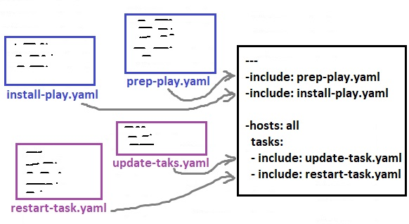

# Template, Roles

## Ansible Template

Managing configurations of multiple servers and environments is a big benefit of using Ansible. But what should we do when configuration files vary from server to server? Before creating  a separate configuration for each server or environment, lets take a look at Ansible templates.

### What is an Ansible Template?

 Sometimes we need to transfer text files to remote hosts. Those text files are usually  configuration files. When we are working with a single server, the configuration file may contain information specific to that server like hostname, IP address, etc. Since we’re working with a single server, we could create the file on the Ansible controller and then use the [copy module](https://docs.ansible.com/ansible/latest/collections/ansible/builtin/copy_module.html) in a [playbook](https://docs.ansible.com/ansible/latest/user_guide/playbooks.html) to copy it to the server.

But what if we have multiple web servers each needing that same configuration file but each with their own specific values? We can’t just copy the configuration file to all machines; it’s only built for a single server with a specific hostname, IP address, etc. So we need an Ansible template.

> Ansible templates allow you to define text files with variables instead of static values and then replace those variables at playbook runtime.

### Ansible Template files

 An Ansible template is a text file built with the [Jinja2 templating language](https://docs.ansible.com/ansible/latest/user_guide/playbooks_templating.html) with a _j2_ file extension. A Jinja2 template looks exactly like the text file you’d like to get onto a remote host. The only difference is that instead of static values, the file contains variables.

 For demonstration, lets install web server on both centos and ubuntu in our lab environment and make sure everything is going fine :

```text
[user1@controller demo-temp]$ ansible ubuntu -b -m apt -a "name=apache2 state=present"
[user1@controller demo-temp]$ ansible centos -b -m yum -a "name=httpd state=present"
```


Next create a template for web server default page \(index.html.j2\):

```text
<html>
<center>
<h1> This machine's hostname is {{ ansible_hostname }}</h1>
<h2> os family is {{ ansible_os_family }}</h2>
<small>file version is {{ file_version }}</small>
{# This is comment, it will not appear in final output #}
</center>
</html>
```

 and related playpook to use this template:

```text
---
#sample playbook using template for web server- template-playbook.yaml

- hosts: all
  become: yes
  vars:
   file_version: 1.0

  tasks:
   - name: install default web page
     template:
       src: index.html.j2
       dest: /var/www/html/index.html
       mode: 0777
```

> We can change file permissions with the template module.

Next we will  put index.html on each server and check the results:

```text
[user1@controller demo-temp]$ ansible-playbook template-playbook.yaml

PLAY [all] ******************************************************************************************************************************

TASK [Gathering Facts] ******************************************************************************************************************
ok: [centos]
ok: [ubuntu]

TASK [install default web page] *********************************************************************************************************
changed: [centos]
changed: [ubuntu]

PLAY RECAP ******************************************************************************************************************************
centos                     : ok=2    changed=1    unreachable=0    failed=0    skipped=0    rescued=0    ignored=0
ubuntu                     : ok=2    changed=1    unreachable=0    failed=0    skipped=0    rescued=0    ignored=0
```


```text
root@ubuntu:~# cat /var/www/html/index.html
<html>
<center>
<h1> This machine's hostname is ubuntu</h1>
<h2> os family is Debian</h2>
<small>file version is 1.0</small>
</center>
</html>
```

```text
[root@centos ~]# cat /var/www/html/index.html
<html>
<center>
<h1> This machine's hostname is centos</h1>
<h2> os family is RedHat</h2>
<small>file version is 1.0</small>
</center>
</html>
```

_To add multiple files on a remote host use loops to template multiple files._


**How ansible templates work ?** 

All templating happens on the Ansible controller **before** the task is sent and executed on the target machine. This approach minimizes the package requirements on the target \(jinja2 is only required on the controller\). It also limits the amount of data Ansible passes to the target machine. Ansible parses templates on the controller and passes only the information needed for each task to the target machine, instead of passing all the data on the controller and parsing it on the target.


## include statement

#### include plays and tasks

Using include statements is our trick to split a large playbook into smaller pieces. We can also move task  to  a separate file and use include statement to include tasks from:



Lets see an example:

```text
[user1@controller demo-file]$ cat update-systems-play.yaml
---

- hosts: all
  become: yes

  tasks:
   - name: update apt
     apt: upgrade=dist update_cache=yes
     when: ansible_os_family == "Debian"

   - name: update yum
     yum: name=* state=latest update_cache=yes
     when: ansible_os_family == "RedHat"  
```

```text
[user1@controller demo-file]$ cat install-web-task.yaml
---

- name: install on debian
  apt: name=apache2 state=latest update_cache=yes
  when: ansible_os_family == "Debian"

- name: install on centos
  yum: name=httpd state=latest update_cache=yes
  when: ansible_os_family == "RedHat"

- name: start debian service
  service: name=apache2 enabled=yes state=started
  when: ansible_os_family == "Debian"

- name: start centos service
  service: name=httpd enabled=yes state=started
  when: ansible_os_family == "RedHat"

```

and finally or main playbook:

```text
[user1@controller demo-file]$ cat include-playbook.yaml
---

- include: update-systems-play.yaml

- hosts: all
  become: yes
  tasks:
   - include: install-web-task.yaml
```

and lets check the results:

```text
[user1@controller demo-file]$ ansible-playbook include-playbook.yaml

PLAY [all] *********************************************************************

TASK [Gathering Facts] *********************************************************
ok: [centos]
ok: [ubuntu]

TASK [update apt] **************************************************************
skipping: [centos]
changed: [ubuntu]

TASK [update yum] **************************************************************
skipping: [ubuntu]
changed: [centos]

PLAY [all] *********************************************************************

TASK [Gathering Facts] *********************************************************
ok: [centos]
ok: [ubuntu]

TASK [install on debian] *******************************************************
skipping: [centos]
ok: [ubuntu]

TASK [install on centos] *******************************************************
skipping: [ubuntu]
ok: [centos]

TASK [start debian service] ****************************************************
skipping: [centos]
ok: [ubuntu]

TASK [start centos service] ****************************************************
skipping: [ubuntu]
changed: [centos]

PLAY RECAP *********************************************************************
centos                     : ok=5    changed=2    unreachable=0    failed=0    skipped=3    rescued=0    ignored=0
ubuntu                     : ok=5    changed=1    unreachable=0    failed=0    skipped=3    rescued=0    ignored=0
```

## Ansible Roles

Like any other programming or scripting language we can start writing huge play books with hundreds of lines, but it is against the simplicity. Also writing long playbooks make them useful  just for  a specific use case and no other one can use it!

In programming languages, we try to  modularize  our code into packages, modules, classes and functions. That way our code becomes more organized, readable and we can share it with others. 

 Obviously we don't have any  programs or classes or functions  in Ansible, what we do have are just inventory files, variables and playbooks. What should we do? When most system administrators use ansible they use roles as the way to organize various plays and playbooks.

Previously we learned how to  include files, it could be confusing, what kind of file are you including? is it a task file? is it a playfile? How it's included? where it's included? The idea of roles give us a folder structure to storing those files and it also automatically include files that are named and placed in a proper place. 


Roles is a new way to organize things. This is very common that people share roles. Usually the file extention on roles is going to be **.yml** on the YAML files instead of **.yaml** . That is because the lent of extention is not important in linux, but when you are sharing roles with other people it is important.



 So **roles** provide a mechanism to break a complicated playbook into multiple reusable components. Each component offers a small function that can be used independently within the playbook. So rather than creating one complex playbook, you can create many roles and simply drop them into your playbooks. 

Lets take a look at an example:

```text
[user1@controller demo-roles]$ tree -F
.
├── roles/
│   └── apache/
│       ├── handlers/
│       │   └── main-handlers.yml
│       └── tasks/
│           └── main-tasks.yml
└── site-playbook.yml

4 directories, 3 files
```

```text
[user1@controller demo-roles]$ cat roles/apache/tasks/main-tasks.yml
---


- name: install on debian
  apt: name=apache2 state=latest update_cache=yes
  when: ansible_os_family == "Debian"
  notify: start debian service

- name: install on centos
  yum: name=httpd state=latest update_cache=yes
  when: ansible_os_family == "RedHat"
  notify: start centos service
```

```text
[user1@controller demo-roles]$ cat roles/apache/handlers/main-handlers.yml
---

- name: start debian service
  service: name=apache2 enabled=yes state=started

- name: start centos service
  service: name=httpd enabled=yes state=started
```

and finally our playbook:

```text
[user1@controller demo-roles]$ cat site-playbook.yml
---

- hosts: all
  become: yes
  roles:
   - apache
```

Lets run it:

```text
[user1@controller demo-roles]$ ansible-playbook site-playbook.yml

PLAY [all] *************************************************************************************************************************************

TASK [Gathering Facts] *************************************************************************************************************************
ok: [centos]
ok: [ubuntu]

PLAY RECAP *************************************************************************************************************************************
centos                     : ok=1    changed=0    unreachable=0    failed=0    skipped=0    rescued=0    ignored=0
ubuntu                     : ok=1    changed=0    unreachable=0    failed=0    skipped=0    rescued=0    ignored=0
```

that's all.

.

.

.

.

[https://adamtheautomator.com/ansible-template/](https://adamtheautomator.com/ansible-template/)

[https://docs.ansible.com/ansible/latest/user\_guide/playbooks\_templating.html](https://docs.ansible.com/ansible/latest/user_guide/playbooks_templating.html)

[https://blog.ssdnodes.com/blog/step-by-step-ansible-guide/](https://blog.ssdnodes.com/blog/step-by-step-ansible-guide/)

.

