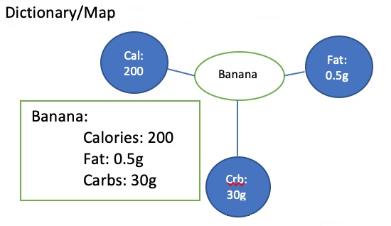

# Understanding YAML

### Data serialization

Whenever you want to send some data structure or an object across computer networks, say the Internet, you have to turn it into a special format to read it and store it. The process is commonly known as serialization and is of enormous importance on the web. A common usage example of serialization is when reading data from databases and transferring it across the web.

### What is YAML?

 **YAML** is a data serialization format that stands for **YAML ain’t Markup language**.


The main advantage of using YAML is readability and writability. If you have a configuration file that needs to be easier for humans to read, it’s better to use YAML. YAML is not a complete substitution of JSON as JSON and XML have their places too; nevertheless, it’s useful learning YAML.

 Another benefit of YAML is its support of various data types like cases, arrays, dictionaries, lists, and scalars. It has good support for the most popular languages like JavaScript, Python, Ruby, Java, etc.



**Rules for Creating YAML file**

When you are creating a file in YAML, you should remember the following basic rules:

* YAML is **case sensitive**
* The files should have **.yaml** or **.yml** as the extension
* YAML **does not allow the use of tabs** while creating YAML files; spaces are allowed instead


### The structure of a YAML file <a id="the-structure-of-a-yaml-file"></a>

The file starts with three dashes. These dashes indicate the start of a new YAML document. 

```text
---


```

The following are the building blocks of a YAML file:

1. **Key Value Pair** — The basic type of entry in a YAML file is of a key value pair. After the Key and colon there is a space and then the value.
2. **Arrays/Lists** — Lists would have a number of items listed under the name of the list. The elements of the list would start with a `-`. There can be a `n` of lists, however the indentation of various elements of the array matters a lot.
3. **Dictionary/Map** — A more complex type of YAML file would be a Dictionary and Map.


### The importance of indentation and spaces

Consider the following diagram, which has details about “Banana.” There are 3 attributes:

1. Calories = 200
2. Fat = 0.5g
3. Carbs = 30g



Suppose there is an extra indentation or spaces used — then the whole meaning of the YAML object changes as you can see below. So we need to be careful with respect to indentation and spaces.


### YAML Datatypes

Here are a few notes about YAML syntax:

### Strings

```text
# Strings don't require quotes:
title: Introduction to YAML

# But you can still use them:
title-with-quotes: 'Introduction to YAML'

# Multiline strings start with |
execute: |
    npm ci
    npm build
    npm test
```

### Numbers

```text
# Integers:
age: 35

# Float:
price: 18.99
```

### Boolean

```text
# Boolean values can be written in different ways:
published: false
published: False
published: FALSE
```

### Null values

```text
# Null can be represented by simply not setting a value:
null-value: 

# Or more explicitly:
null-value: null
null-value: NULL
null-value: Null
```

### Dates & timestamps

```text
# ISO-Formatted dates can be used

date: 2002-12-14
canonical: 2001-12-15T02:59:43.1Z
iso8601: 2001-12-14t21:59:43.10-05:00
spaced: 2001-12-14 21:59:43.10 -5
```

### Arrays / Lists

```text
# A list of numbers using hyphens:
numbers:
    - one
    - two
    - three

# The inline version
numbers: [ one, two, three ]
```

### Dictionaries

```text
# An employee record
martin:
  name: Martin D'vloper
  job: Developer
  skill: Elite

# The inline version
martin: {name: Martin D'vloper, job: Developer, skill: Elite}  
```

### Dictionaries vs Lists

Dictionary is an unordered collection whereas lists are ordered collection.


### Nested values

We can use all of the above types to create an object with nested values, such as lists of dictionaries, dictionaries whose values are lists or a mix of both:

```text
# Employee records
- martin:
    name: Lisa
    job: Developer
    skills:
      - python
      - perl
      - pascal
- tabitha:
    name: Linda
    job: Developer
    skills:
      - lisp
      - fortran
      - erlang
```

### List of Objects

```text
# Let's list books:
- nineteen-eighty-four:
    author: George Orwell
    published-at: 1949-06-08
    page-count: 328
    description: |
        A Novel, often published as 1984, is a dystopian novel by English novelist George Orwell.

- the-hobbit:
    author: J. R. R. Tolkien
    published-at: 1937-09-21
    page-count: 310
    description: | 
        The Hobbit, or There and Back Again is a children's fantasy novel by English author J. R. R. Tolkien.
```

Also remember any line beginning with a hash is automatically ignored and considered as a comment.


.

.

.

[https://www.tutorialspoint.com/ansible/ansible\_yaml\_basics.htm](https://www.tutorialspoint.com/ansible/ansible_yaml_basics.htm)

[https://www.guru99.com/ansible-tutorial.html](https://www.guru99.com/ansible-tutorial.html)

[https://www.tutorialspoint.com/yaml/yaml\_introduction.htm](https://www.tutorialspoint.com/yaml/yaml_introduction.htm)

[https://www.tutorialspoint.com/yaml/yaml\_basics.htm](https://www.tutorialspoint.com/yaml/yaml_basics.htm)

[https://geekflare.com/yaml-introduction/](https://geekflare.com/yaml-introduction/)

[https://developer.ibm.com/technologies/containers/tutorials/yaml-basics-and-usage-in-kubernetes/](https://developer.ibm.com/technologies/containers/tutorials/yaml-basics-and-usage-in-kubernetes/)

[https://dev.to/paulasantamaria/introduction-to-yaml-125f](https://dev.to/paulasantamaria/introduction-to-yaml-125f)

[https://docs.ansible.com/ansible/latest/reference\_appendices/YAMLSyntax.html](https://docs.ansible.com/ansible/latest/reference_appendices/YAMLSyntax.html)

.


